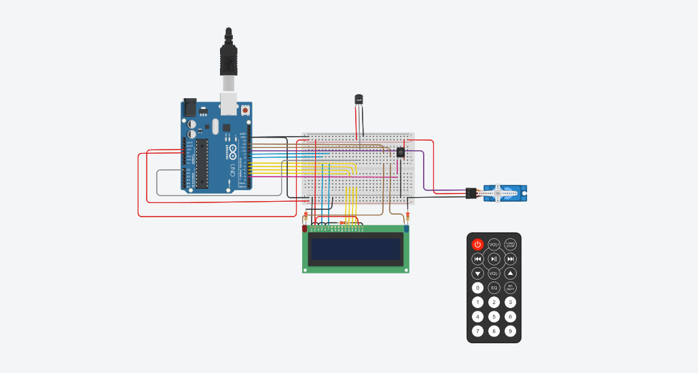
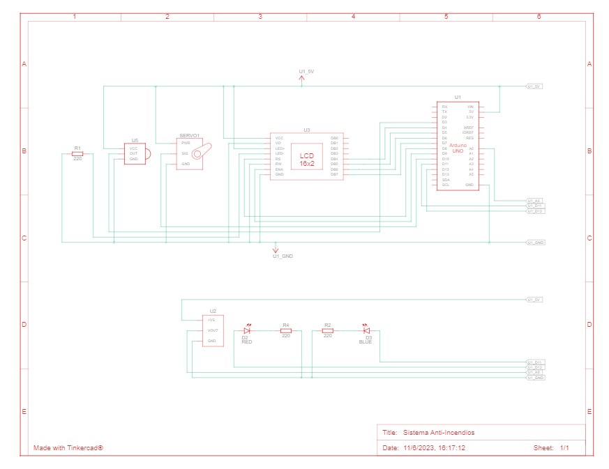

# Sistema-anti-Incendios 🔥

##                        OBJETIVO DEL PROYECTO 📑
#### 
Diseñar un sistema de incendio utilizando Arduino que pueda
detectar cambios de temperatura y activar un servo motor en caso de detectar un incendio.
Además, se mostrará la temperatura actual y la estación del año en un display LCD. 
#### 

## MATERIALES UTILIZADOS 🔧
### Sensor de temperatura
- Leé constantemente la temperatura 
### Control remoto IR (Infrarrojo)
- Para controlar el sistema de una forma mas comoda
### Display LCD (16x2 caracteres)
- Muestra la temperatrua, la estacion del año y una alerta en caso de incendio
### Servo motor
- Su movimieto simula al de un aspersor de techo
### Protoboard para realizar las conexiones
- Hace que quede todo mucho mas ordenado
### LED de estado (Azul) 
- Se encuentra montado en la esquina superior derecha del Lcd e indica el estado del sistema (encendido o apagado)
### LED de alarma (Rojo) 
- Se cuentra montado en la esquina superior izquierda de nuestro Lcd y se prende en caso de incendio 

## PREVIEW 🔍

## VISTA ESQUEMATICA 📐
 
